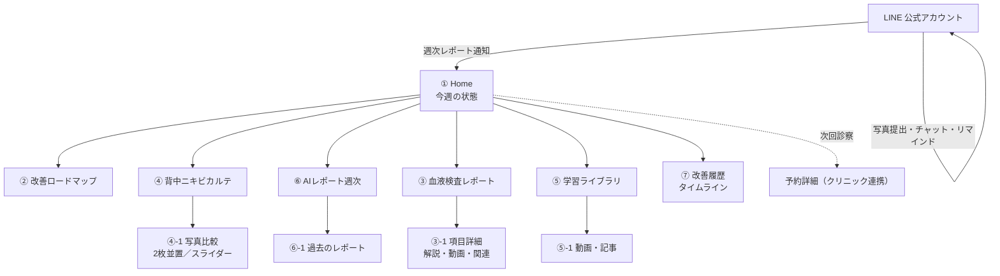
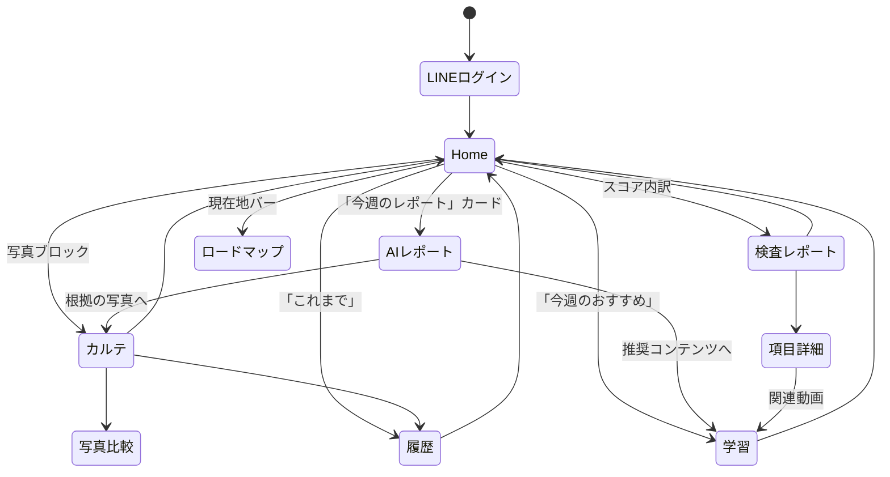

# 診断後の継続伴走 Web アプリ — 設計書

**版**: v1（2026-08）
**対象**: 美容クリニックで血液検査・背中ニキビ診断を受けた 20〜40代の男女
**構成**: LINE（対話・提出・通知）＋ Web（成果の可視化）
**コンセプト**: 診断ではなく改善。毎週、自分の変化を実感できること。

---

## 0. 設計の背骨（これだけは動かさない）

### 0.1 役割分担 — LINE が動詞、Web が名詞

| | LINE | Web |
|---|---|---|
| 役割 | **する場所**（対話・提出・通知・リマインド） | **見る場所**（成果・変化・履歴） |
| 頻度 | 毎日〜週数回 | **週1回**（日曜のレポート着信時） |
| 入力 | ほぼすべてここ | **原則ゼロ**（読むだけ） |
| 通知 | 持つ | **持たない** |
| ログイン | LINE アカウント | LINE ログイン（Web 独自の ID を作らない） |

> **Web にフォームを置かない。** 入力を Web に持たせた瞬間、LINE との二重管理が生まれ、
> ユーザーは「どっちで出すんだっけ」で止まる。Web は読み取り専用に近づけるほど強い。

### 0.2 週次のリズムが商品

```
日曜 20:00  AIレポート生成 → LINEで通知「今週のレポートが出ました」
      ↓
      Web を開く（週1回の“ハレの日”）
      ↓
      Home で「前回より良くなっている」を3秒で受け取る
      ↓
      気になった人だけ、カルテ／検査／学習へ潜る
      ↓
月〜土  LINE で「今日のひとつ」「写真出して」「質問」
```

**Web の成功指標は滞在時間ではなく「週次の再訪率」。**
開いて3秒で満足して閉じるのが正しい。

### 0.3 いちばん難しい設計判断 — 悪化した週をどう見せるか

改善スコアを単一の数値にすると、**下がった週にユーザーが消える**。
このアプリの生死はここで決まる。

- スコアは **「変化」と「実行」の二層**にする。変化が停滞しても、実行が続いていれば評価される
- 下がった週は数値を隠さない。ただし **主語をユーザーにしない**
  （× あなたの改善率が下がりました ／ ○ 今週は肌のゆらぎが出やすい時期でした）
- 悪化時は必ず **原因の候補**と**次の1つ**をセットで出す。数字だけを置いて去らない
- 「連続記録が途切れた」演出は作らない。途切れを罰する仕組みは離脱を生む

### 0.4 医療・薬機法の線引き（UI に埋め込む制約）

- 効果を断定しない。「治る」「改善します」は使わない → 「〜の可能性があります」「〜とされています」
- 改善率・スコアは **本人の記録の推移**であって、効果の証明ではないと明記
- 検査値の解釈は医師の領域。AI解説は **医師監修のテンプレートの範囲内**で生成し、公開前に医療者が承認
- Before/After 写真は**同一条件（距離・照明・角度）**でのみ並置。加工・補正はしない

---

## 1. サイトマップ



**階層は2層まで。** Home から1タップで全機能に届く。3層目を作らない。

---

## 2. 画面遷移図



**戻り先は常に Home。** タブは持つが、深い画面からは1タップで Home に戻れる。

---

## 3. 各画面のワイヤーフレーム

> 幅は 390px（iPhone）基準。Web は 480px で止め、PC でも端末の形のまま中央に置く。

### ① Home — 3秒で「良くなっている」

```
┌──────────────────────────────┐
│ 🌿 ○○クリニック        [設定] │  ← 高さ56px
├──────────────────────────────┤
│                              │
│  今週の状態                   │  ← 14px / muted
│  ┌────────────────────────┐  │
│  │        ◜◝              │  │
│  │      68 ── ↑ 6         │  │  ← 数字は48px。↑6 は緑
│  │        ◟◞              │  │     リング（達成率）
│  │   前回より 6 上がりました │  │  ← ここが本体のコピー
│  └────────────────────────┘  │
│                              │
│  ┌────────────────────────┐  │
│  │ 🤖 AIから               │  │
│  │ 「炎症のサインが落ち着い │  │  ← 3行まで。以上は畳む
│  │  てきました。今週は保湿  │  │
│  │  を続けましょう」        │  │
│  │              [レポート→] │  │
│  └────────────────────────┘  │
│                              │
│  ┌───────────┬────────────┐  │
│  │ 4/9 の写真 │ 今日の写真  │  │  ← Before/After は
│  │  [image]  │  [image]   │  │     Home に必ず出す
│  └───────────┴────────────┘  │
│  炎症 3 → 1 ／ 色素 4 → 3     │
│                  [カルテ→]    │
│                              │
│  いまここ ●━━━━━○────○       │  ← ロードマップ圧縮版
│  生活改善（3/6週目）          │
│                              │
│  次回診察  8月14日(木) 15:00  │
│  ┌────────────────────────┐  │
│  │ 📘 今週のおすすめ動画     │  │
│  └────────────────────────┘  │
└──────────────────────────────┘
    [ホーム] [カルテ] [まなぶ]      ← 下タブ3つ
```

**Home の設計原則**
- ファーストビューに **スコア＋前回比＋AIの一言** の3つだけ。それ以上は下
- スコアの下のコピーは常に **変化の文**（「前回より6上がりました」）。数字は補助
- 写真は Home に置く。**開いた瞬間に視覚的な差分**が来るのが最も効く

---

### ② 改善ロードマップ — 現在地が一目

```
┌──────────────────────────────┐
│ ← 改善ロードマップ            │
├──────────────────────────────┤
│  6ヶ月の道のり ・ 3ヶ月目     │
│                              │
│  ●  血液検査          済 4/2 │
│  │                           │
│  ●  原因分析          済 4/9 │
│  │                           │
│  ◉  生活改善      ← いまここ │  ← 太いリング＋色
│  │  3/6週目 ▓▓▓░░░           │
│  │  「材料をそろえる時期」   │
│  │  [今週やること →]         │
│  │                           │
│  ○  背中ニキビの改善   予定  │
│  │  目安：7月ごろ            │
│  ○  色素沈着の改善     予定  │
│  ○  維持                予定 │
└──────────────────────────────┘
```

- 未達のステップも**日付の目安**を出す（先が見えないと続かない）
- 現在地のステップだけ**中身を展開**、他は畳む
- 「遅れています」は言わない。**時期は幅で示す**（7月ごろ）

---

### ③ 血液検査レポート — 一般ユーザー向け

```
┌──────────────────────────────┐
│ ← 血液検査レポート            │
│  7/20 の検査 ／ 前回 4/2      │
├──────────────────────────────┤
│      ⬡ レーダー（6つの力）    │  ← 前回を破線で重ねる
│   運ぶ力・守る力・つくり直す力 │
│   材料・動かす力・乱さない力   │
│      --- 前回  ── いま        │
│                              │
│  気になる項目 2件            │  ← 全項目ではなく
│  ┌────────────────────────┐  │     "気になる"だけ先頭
│  │ ☀️ 守る力（ビタミンD）    │  │
│  │ 18 → 34    目安 40〜60   │  │
│  │ ▓▓▓▓▓▓▓░░░  85%         │  │
│  │ 重要度 ★★★               │  │
│  │ ▸ AI解説                 │  │
│  │ ▸ 背中ニキビとの関係      │  │
│  │ ▸ 今日からできること      │  │
│  │ ▶ 動画で見る（2分）       │  │
│  └────────────────────────┘  │
│  ▾ 目安に届いた項目 4件       │  ← 畳む
│  ▾ すべての検査値（32項目）    │  ← 畳む
│                              │
│  この内容は◯◯医師が確認済み   │
└──────────────────────────────┘
```

- **全項目を並べない。** 「気になる2件」→「届いた4件（畳）」→「全部（畳）」の3段
- 項目カードは **数値 → バー → 重要度 → 解説3行 → 動画** の固定順
- 基準値と**目安（適正値）を分けて**持つ。「基準内だが目安から外れている」を拾えることが価値

---

### ④ 背中ニキビカルテ — 見比べる UX

```
┌──────────────────────────────┐
│ ← 背中ニキビカルテ            │
├──────────────────────────────┤
│  [ 2枚くらべる ] [ タイムライン ] │  ← セグメント
│                              │
│  ┌───────────┬────────────┐  │
│  │   4/9     │   7/25     │  │
│  │  [写真]   │  [写真]    │  │  ← 同スケール・同条件
│  │           │            │  │
│  └───────────┴────────────┘  │
│    ◀ 比較する日を選ぶ ▶       │  ← 左右で日付変更
│                              │
│  炎症レベル   3 → 1  ↓改善    │
│  ▓▓▓░░ → ▓░░░░               │
│  色素沈着     4 → 3  ↓改善    │
│  ▓▓▓▓░ → ▓▓▓░░               │
│  改善率       — 42%           │
│                              │
│  🤖 AI解析                    │
│  「赤みの範囲が狭くなってい   │
│   ます。色素は時間がかかる    │
│   ところなので、日焼け対策を  │
│   続けましょう」              │
│                              │
│  写真はクリニックとご自宅の   │
│  両方から。撮り方は LINE で   │
│  ご案内しています             │
└──────────────────────────────┘
```

- **既定は2枚比較**（タイムラインは副）。人は並べないと差が分からない
- スライダー（オーバーレイ）は**背中では使わない** — 撮影位置がずれると嘘に見える。**横並び**が正解
- 炎症・色素を**別々に**出す。色素は遅れて改善するので、同じ指標に混ぜると「効いていない」に見える

---

### ⑤ 学習ライブラリ — 動画中心

```
┌──────────────────────────────┐
│ まなぶ                        │
├──────────────────────────────┤
│  あなたに合わせて             │  ← パーソナライズ棚を先頭
│  ┌────┐┌────┐┌────┐         │
│  │▶2:10││▶3:40││▶1:50│  →    │
│  │ビタD ││鉄と肌││日焼け│        │
│  └────┘└────┘└────┘         │
│                              │
│  背中ニキビ                   │
│  ┌────┐┌────┐┌────┐  →      │
│  血液検査                     │
│  ┌────┐┌────┐┌────┐  →      │
│  食事 / 睡眠 / スキンケア / サプリ │
└──────────────────────────────┘
```

- 棚（横スクロール）は **5つまで**。Netflix 型は棚が増えると死ぬ
- 先頭は必ず **「あなたに合わせて」**（検査結果とロードマップの現在地から選ぶ）
- 1本 **3分以内**。移動中に観られない長さは観られない
- 視聴済みは薄く。**未視聴を目立たせる**（進捗ではなく次の1本）

---

### ⑥ AIレポート（週次）

```
┌──────────────────────────────┐
│ ← 今週のレポート  7/21-7/27   │
├──────────────────────────────┤
│  今週のまとめ                 │
│  「炎症が落ち着いてきました」  │  ← 1文。ここだけ大きく
│                              │
│  ✓ よかったこと               │
│   ・保湿を6日続けられました   │
│   ・炎症レベルが 2→1 に       │
│                              │
│  ⚠ 気をつけたいこと           │
│   ・睡眠が5時間台の日が3日    │
│   ・色素沈着は横ばいです      │
│                              │
│  → 来週の1つ                  │
│  ┌────────────────────────┐  │
│  │ 寝る前のスマホを、        │  │
│  │ ベッドの外に置く          │  │
│  │        [LINEで受け取る]  │  │  ← 実行はLINEへ渡す
│  └────────────────────────┘  │
│                              │
│  ▾ 根拠になったデータ          │
│  ▾ 過去のレポート（12件）      │
└──────────────────────────────┘
```

- 構成は **よかった → 気をつけたい → 来週の1つ** で固定。順番を変えない
- 「悪化」ではなく **「気をつけたいこと」**。断定も評価もしない
- 来週の提案は **必ず1つだけ**。3つ出すと0になる

---

### ⑦ 改善履歴 — 人生のカルテ

```
┌──────────────────────────────┐
│ ← これまでの記録              │
│  [すべて][検査][写真][施術][AI] │  ← フィルタ
├──────────────────────────────┤
│  2026年7月                    │
│  ● 7/27 AIレポート            │
│  ● 7/25 写真（自宅）          │
│  ● 7/20 血液検査 2回目        │
│  ● 7/14 施術 5回目            │
│  ─────────────────────────    │
│  2026年6月                    │
│  ● 6/28 AIレポート            │
│  ...                          │
│                              │
│  [記録をPDFで受け取る]        │  ← 転院・保存needs
└──────────────────────────────┘
```

- 月見出しで区切る。**無限スクロールにしない**（1年で破綻する）
- PDF書き出しは地味だが**解約抑止**に効く（自分の資産だと感じる）

---

## 4. コンポーネント設計

### 4.1 階層

```
tokens（色・余白・角丸・影・タイポ）
  └ primitives   Button / Card / Chip / Sheet / Tabs / Skeleton / EmptyState
      └ domain   ScoreRing / DeltaBadge / PhotoCompare / LabRadar / LabItemCard
                 RoadmapStepper / AiCommentCard / WeeklyReportCard / TimelineItem
                 VideoCard / VideoShelf
          └ screens  Home / Roadmap / LabReport / Chart / Library / Report / History
```

### 4.2 主要ドメインコンポーネント

| 名前 | 責務 | 主なProps | 状態 |
|---|---|---|---|
| `ScoreRing` | 改善スコアを円で。前回比を必ず併記 | `score, prev, size` | 上昇/横ばい/下降で色と文言が変わる |
| `DeltaBadge` | 変化量のチップ | `from, to, direction` | 良化=緑 / 横ばい=グレー / 悪化=琥珀（赤は使わない） |
| `PhotoCompare` | 2枚横並び＋日付選択 | `left, right, onPick` | 片方欠損時は「まだありません」 |
| `LabRadar` | 6軸レーダー。前回を破線 | `labels, values, compare, onSelect` | 既存実装を流用可 |
| `LabItemCard` | 検査1項目の全部入り | `row, importance, media` | 解説は既定で畳む |
| `RoadmapStepper` | 現在地つき縦ステッパー | `steps, currentIndex` | 現在地のみ展開 |
| `AiCommentCard` | AIの一言。監修バッジつき | `text, reviewedBy, href` | 生成中スケルトンあり |
| `WeeklyReportCard` | 週次レポート要約 | `week, summary, nextAction` | 未読バッジ |
| `VideoShelf` | 横スクロールの棚 | `title, items` | 視聴済みは減光 |
| `TimelineItem` | 履歴1件 | `kind, at, title, href` | kind別アイコン |

### 4.3 状態の型（すべての画面で必ず用意する4状態）

```
loading   → Skeleton（白画面にしない）
empty     → EmptyState（初回はデータが無い。次の一歩を必ず1つ）
error     → 原因ではなく「もう一度」を出す。入力中の内容は失わない
partial   → 検査はあるが写真が無い等。欠けている側を静かに畳む
```

> **初回ユーザーの Home は必ず空。** ここを設計しないと初週で失われる。
> 「検査結果が届くまで、こちらをご覧ください」→ 学習ライブラリへ逃がす。

---

## 5. デザインシステム

### 5.1 カラー

| 役割 | 値 | 用途 |
|---|---|---|
| Surface | `#FFFFFF` | カード |
| Background | `#F7F8F7` | 画面地 |
| Ink / primary | `#1B1F1D` | 見出し・数値 |
| Ink / secondary | `#5B635E` | 本文 |
| Ink / muted | `#98A09B` | 補助 |
| **Accent（primary）** | `#2F6B52` | 主要アクション・現在地・良化 |
| Accent light | `#E8F1EC` | 帯・選択中の面 |
| Warning | `#9A6B2F` | 気をつけたいこと（**赤は使わない**） |
| Line | `#E7EAE8` | 罫線・グリッド |

**赤を持たない。** 美容医療で赤は「異常」に直結し、不安を煽る。
悪化は琥珀（Warning）で「注意して見る」程度に留める。

**グラフの配色規則**
- 前後比較 = **1色2段**（前回＝薄い破線・塗りなし／今＝濃い実線）
- 系列が2つを超えるときはグラフを分ける。色を増やさない
- 色だけに意味を持たせない（線種・直接ラベル・数値リストを必ず併用）

### 5.2 タイポグラフィ

| 用途 | サイズ / 太さ |
|---|---|
| スコア（ヒーロー数値） | 48 / 800 ・ tabular-nums |
| 画面見出し | 20 / 700 |
| セクション見出し | 15 / 700 |
| 本文 | 14 / 400 ・ line-height 1.8 |
| 補助 | 12 / 400 |
| ラベル | 11 / 600 |

和文は `Hiragino Sans` → `Noto Sans JP`。**数字は必ず等幅**（週次で並べたとき桁が揺れない）。

### 5.3 レイアウト

- 余白スケール `4 / 8 / 12 / 16 / 24 / 32 / 48`
- 角丸 `12`（チップ）/ `16`（カード）/ `24`（ヒーロー）
- 影は1段だけ `0 1px 2px rgba(0,0,0,.04)`。多層は使わない
- 画面幅は **480px で固定**、PC では中央寄せ
- **タップ領域は最小 44px**。例外はスイッチ（見た目24px＋当たり判定44px）

### 5.4 モーション

- 200ms / ease-out。**達成の瞬間だけ 400ms** の演出を許可
- `prefers-reduced-motion` で全停止
- スコアのカウントアップは**しない**（数字が動くと不安になる人がいる）

### 5.5 ことばの規則

| 禁止 | 代替 |
|---|---|
| 治る・改善します・効果があります | 〜の可能性があります／〜とされています |
| 悪化しています | 今週は〜が出やすい時期でした |
| できていません | まだ途中です／おやすみの日もあります |
| ◯日連続が途切れました | （出さない） |

---

## 6. MVP で実装すべきもの

> **7画面すべては作らない。** 週次の体験が回るかを検証するには3画面で足りる。

### Phase 1（8週間） — 「週1回、開く理由」を成立させる

| # | 画面 | 入れる | 入れない |
|---|---|---|---|
| 1 | **Home** | スコア＋前回比、AIの一言、Before/After 2枚、次回診察 | ロードマップ詳細、おすすめ動画 |
| 2 | **背中ニキビカルテ** | 2枚比較、炎症・色素レベル、改善率 | AI画像解析（人が入力）、タイムライン |
| 3 | **AIレポート（週次）** | よかった／気をつけたい／来週の1つ、過去分 | 根拠データの展開 |

**同時に必要な非画面**
- LINE 公式アカウント：週次通知・写真提出・リマインド・チャット
- LINE ログイン（Web 独自 ID を作らない）
- スタッフ用の**最小管理画面**（写真の登録、炎症・色素の評価、AI下書きの承認）
- 監修フロー：AIが書いたものは**必ず人が承認してから公開**

**Phase 1 の合格条件**
- 週次の再訪率 **50%以上**（通知を受けて開く人の割合）
- 4週継続率 **70%以上**
- 「前回より良くなっているか、開いて3秒で分かったか」の回答が **80%以上**

### Phase 2（+6週） — 納得の深さ
- 血液検査レポート（レーダー＋気になる項目＋動画）
- 改善ロードマップ
- 学習ライブラリ（棚3つから）

### Phase 3 — 資産化
- 改善履歴タイムライン、PDF書き出し
- AI画像解析（炎症・色素の自動評価）※ 人の承認は残す
- 複数クリニック対応・院ごとのテーマ

---

## 7. 将来的な拡張

| 時期 | 機能 | 狙い |
|---|---|---|
| 近 | 再検査サイクルの提案（3ヶ月ごと） | 継続の自然な理由をつくる |
| 近 | 家族・パートナーへの共有リンク | 続ける動機は他者の目 |
| 中 | 同じ悩みの人の**匿名の中央値**と比較 | 「自分だけではない」 |
| 中 | サプリ・スキンケアの購買連携 | クリニックの物販収益 |
| 中 | 卒業後の**維持プラン**（月1のライト伴走） | LTV の延長 |
| 遠 | 施術・生活・検査の**効果の因果分析** | 何が効いたかを店舗に返す |
| 遠 | 症例データの**匿名統計**（同意ベース） | 監修と学術の資産化 |

---

## 8. 既存資産との対応（この設計にそのまま使えるもの）

| この設計 | 既存実装 | 状態 |
|---|---|---|
| 血液検査レポート・レーダー | `components/charts/lab-radar.tsx` | **そのまま流用可** |
| 検査の翻訳（解説・関連・アドバイス） | `lib/accord/labtest-fixtures.ts` の翻訳データ | 流用可 |
| Before/After 比較 | `components/progress/before-after.tsx` | 日付選択の追加が必要 |
| 週次AIレポート | `components/accord/copilot-brief.tsx`（店舗向け） | **顧客向けに書き直し** |
| 学習ライブラリ | `components/lessons/*`（7章の図解） | 動画の追加が必要 |
| 改善履歴 | 顧客詳細のタイムライン | 顧客向けに再構成 |
| 空・読込・失敗の状態 | `components/ui/empty-state.tsx` `skeleton.tsx` `app/error.tsx` | そのまま |

**新規に必要なのは、スコア（ScoreRing）・ロードマップ・動画基盤・LINE連携の4つ。**

---

## 9. この設計で意図的に「やらない」こと

- Web に通知を持たせない（LINE と二重になる）
- Web にフォームを置かない（提出は LINE）
- スコアを1つの数値だけで語らない（下がった週に人が消える）
- 連続日数を罰する演出をしない
- 赤色を使わない
- 画面を7つ同時に作らない（Phase 1 は3つ）
